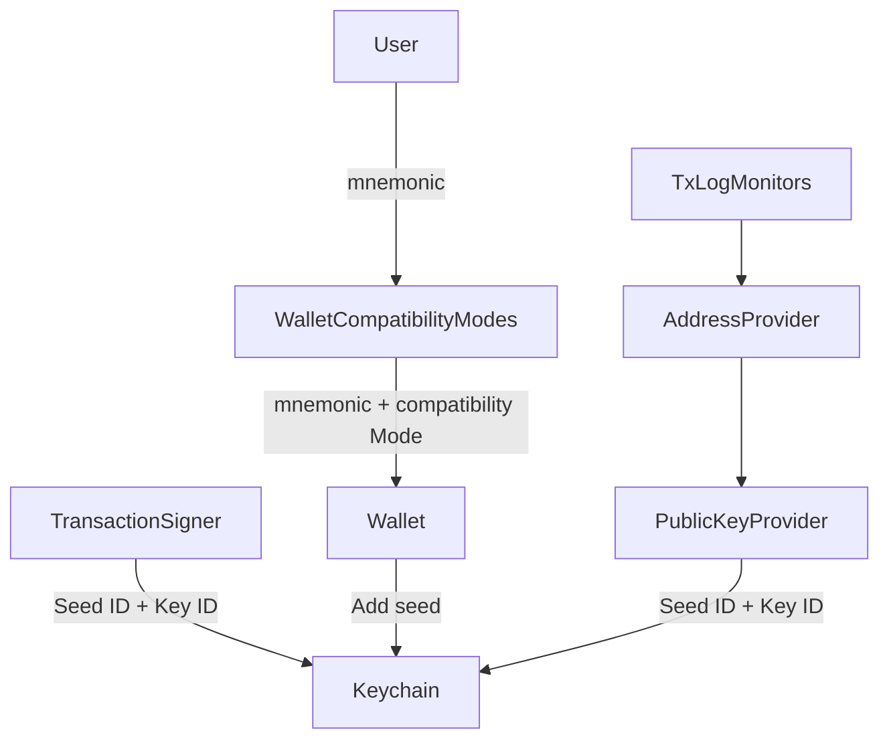

# Multi-seed Support

The Exodus SDK supports managing wallets with multiple seeds. If you're building a single-seed-per-user wallet, you can ignore this feature.

## Architecture

## Links to key players in the game

- Keychain
  - [addSeed](https://github.com/ExodusMovement/exodus-oss/blob/ad221186a02c7dc5707c6749a024c5021938d15f/features/keychain/module/keychain.js#L73-L84)
  - [exportKey](https://github.com/ExodusMovement/exodus-oss/blob/ad221186a02c7dc5707c6749a024c5021938d15f/features/keychain/module/keychain.js#L104) with additional `seedId` parameter
- WalletAccounts
  - [creating a wallet account on add seed](https://github.com/ExodusOSS/hydra/blob/8ac3c1382e3d51923de4d73c43c32f92005ae351/features/wallet-accounts/plugins/lifecycle.js#L101)
  - [considering the seed id on creation](https://github.com/ExodusOSS/hydra/blob/8ac3c1382e3d51923de4d73c43c32f92005ae351/features/wallet-accounts/module/wallet-accounts.js#L285-L299)
  - [adapting wallet accounts synced from firebase](https://github.com/ExodusOSS/hydra/blob/8ac3c1382e3d51923de4d73c43c32f92005ae351/features/wallet-accounts/module/wallet-accounts.js#L220-L223) (Exodus only)
- Application
  - [adding a seed](https://github.com/ExodusOSS/hydra/blob/8ac3c1382e3d51923de4d73c43c32f92005ae351/features/application/src/modules/application.ts#L252-L261)
- Wallet
  - [adding a seed](https://github.com/ExodusOSS/hydra/blob/8ac3c1382e3d51923de4d73c43c32f92005ae351/features/wallet/module/wallet.js#L115-L143)
  - [updating a seed](https://github.com/ExodusOSS/hydra/blob/8ac3c1382e3d51923de4d73c43c32f92005ae351/features/wallet/module/wallet.js#L180-L192)
  - [clearing seeds from keychain when locking](https://github.com/ExodusOSS/hydra/blob/8ac3c1382e3d51923de4d73c43c32f92005ae351/features/wallet/module/wallet.js#L259)
- `WalletAccount` model
  - [new properties](https://github.com/ExodusOSS/hydra/blob/8ac3c1382e3d51923de4d73c43c32f92005ae351/libraries/models/src/wallet-account/index.js#L89-L92)
  - [new source](https://github.com/ExodusOSS/hydra/blob/8ac3c1382e3d51923de4d73c43c32f92005ae351/libraries/models/src/wallet-account/index.js#L24)
  - [unique ID for seed wallet accounts](https://github.com/ExodusOSS/hydra/blob/8ac3c1382e3d51923de4d73c43c32f92005ae351/libraries/models/src/wallet-account/index.js#L170-L178)
- PublicKeyProvider
  - [export a public key](https://github.com/ExodusOSS/hydra/blob/8ac3c1382e3d51923de4d73c43c32f92005ae351/features/public-key-provider/module/public-key-provider.ts#L145-L148)
- TransactionSigner
  - [sign a transaction](https://github.com/ExodusOSS/hydra/blob/8ac3c1382e3d51923de4d73c43c32f92005ae351/features/tx-signer/src/module/seed-signer.ts#L113-L152)
