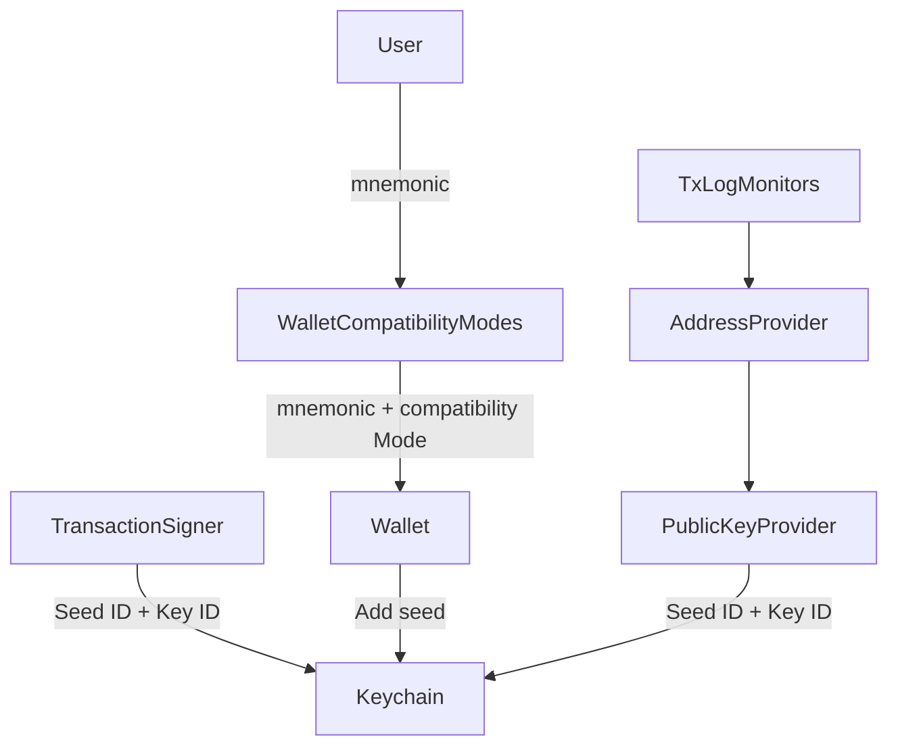

# Multi-seed Support

The Exodus SDK supports managing wallets with multiple seeds. If you're building a single-seed-per-user wallet, you can ignore this feature.

## Architecture

[Multi-seed Architecture Walkthrough](https://www.loom.com/share/e2870777a641434296b4473a7b27e894?sid=b365c944-0a68-4cef-a047-2ffaeea81ebc)

## Links to key players in the game

- Keychain
  - [addSeed](https://github.com/ExodusMovement/exodus-oss/blob/ad221186a02c7dc5707c6749a024c5021938d15f/features/keychain/module/keychain.js#L73-L84)
  - [exportKey](https://github.com/ExodusMovement/exodus-oss/blob/ad221186a02c7dc5707c6749a024c5021938d15f/features/keychain/module/keychain.js#L104) with additional `seedId` parameter
- WalletAccounts
  - [creating a wallet account on add seed](https://github.com/ExodusMovement/exodus-hydra/blob/3d801cc55c4fa28d1b6e723cbcb78e32c76f247f/features/wallet-accounts/plugins/lifecycle.js#L85)
  - [considering the seed id on creation](https://github.com/ExodusMovement/exodus-hydra/blob/3d801cc55c4fa28d1b6e723cbcb78e32c76f247f/features/wallet-accounts/module/wallet-accounts.js#L255-L277)
  - [adapting wallet accounts synced from firebase](https://github.com/ExodusMovement/exodus-hydra/blob/3d801cc55c4fa28d1b6e723cbcb78e32c76f247f/features/wallet-accounts/module/wallet-accounts.js#L192-L194) (Exodus only)
- Application
  - [adding a seed](https://github.com/ExodusMovement/exodus-hydra/blob/c7fe9e555127456a1933f3ec929c6e5765c3681b/features/application/src/modules/application.ts#L250-L257)
- Wallet
  - [adding a seed](https://github.com/ExodusMovement/exodus-hydra/blob/fca531e5323162d06c098f7e669f07f2ca5b3b09/features/wallet/module/wallet.js#L110-L138)
  - [updating a seed](https://github.com/ExodusMovement/exodus-hydra/blob/fca531e5323162d06c098f7e669f07f2ca5b3b09/features/wallet/module/wallet.js#L140-L152)
  - [clearing seeds from keychain when locking](https://github.com/ExodusMovement/exodus-hydra/blob/fca531e5323162d06c098f7e669f07f2ca5b3b09/features/wallet/module/wallet.js#L216)
- `WalletAccount` model
  - [new properties](https://github.com/ExodusMovement/exodus-hydra/blob/5dbe4d0a17e598e7594e44778e64086ba2b31c0c/libraries/models/src/wallet-account/index.js#L106-L107)
  - [new source](https://github.com/ExodusMovement/exodus-hydra/blob/5dbe4d0a17e598e7594e44778e64086ba2b31c0c/libraries/models/src/wallet-account/index.js#L64)
  - [unique ID for seed wallet accounts](https://github.com/ExodusMovement/exodus-hydra/blob/5dbe4d0a17e598e7594e44778e64086ba2b31c0c/libraries/models/src/wallet-account/index.js#L170-L178)
- PublicKeyProvider
  - [export a public key](https://github.com/ExodusMovement/exodus-hydra/blob/01122e2f5ec0f4499f17071969ee9d4aee8f4b25/features/public-key-provider/module/public-key-provider.ts#L79-L82)
- TransactionSigner
  - [signing for different signature types](https://github.com/ExodusMovement/exodus-hydra/blob/a2b19f55fa6bb1b2448606c022cc2da1321f272e/features/tx-signer/src/module/seed-signer.ts#L161-L172)
- WalletCompatiblityModes
  - [detect](https://github.com/ExodusMovement/exodus-hydra/blob/d6f1a4412b9b85105531bc0a06d8cb608271f39f/features/wallet-compatibility-modes/api/index.js#L6) the `compatibilityMode`

All the work that has been done:
https://github.com/issues?page=1&q=is:pr+sort:updated-desc+label:%22multi+seed%22+user:ExodusMovement
