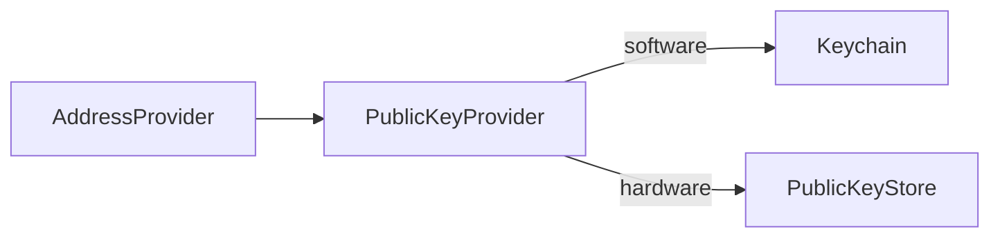

# @exodus/address-provider

This module derives addresses for assets from different wallet accounts. Addresses for software wallet accounts are encoded public keys that are derived from the seed using Keychain, whereas hardware wallet accounts use the public keys stored in the [public-key-store](../public-key-provider/module/store).



Address derivation can be pretty expensive on certain platforms (\*cough, mobile\*). So this package also includes a simple walletAccount and bip32 path based cache.

## Install

```sh
yarn add @exodus/address-provider
```

## Usage

This feature is designed to be used together with `@exodus/headless`. See [using the sdk](../../docs/docs-website/docs/development/using-the-sdk.md).

### Play with it

1. Open the playground https://exodus-hydra.pages.dev/features/address-provider
2. Try out some methods via the UI. These correspond 1:1 with the `exodus.addressProvider` API.
3. Run `await exodus.addressProvider.getReceiveAddress({ walletAccount: 'exodus_0', assetName: 'bitcoin' })` in the Dev Tools Console.

### API Side

See [using the sdk](../../docs/docs-website/docs/development/using-the-sdk.md#setup-the-api-side) for more details on how features plug into the SDK and the API interface in the [type declaration](./api/index.d.ts).

```ts
const address = await exodus.addressProvider.getAddress({
  purpose: 44,
  assetName: 'bitcoin',
  walletAccount: 'exodus_0',
  chainIndex: 0,
  addressIndex: 0,
})

const receiveAddress = await exodus.addressProvider.getReceiveAddress({
  assetName: 'bitcoin',
  walletAccount: 'exodus_0',
})

const unusedReceiveAddress = await exodus.addressProvider.getReceiveAddress({
  assetName: 'bitcoin',
  walletAccount: 'exodus_0',
  multiAddressMode: true,
})
```

If you're building a feature that requires the wallet's addresses, add a dependency on the `addressProvider` module, which provides almost the same API as the external `exodus.addressProvider` [API](https://github.com/ExodusMovement/exodus-hydra/blob/533a105af69fabb690e2c0c5fd4b3a21a2500526/features/address-provider/api/index.js#L35-L43) (caveat: the module expects `WalletAccount` instances, while the API expects WalletAccount names like `'exodus_0'`).

### UI Side

See [using the sdk](../../docs/docs-website/docs/development/using-the-sdk.md#events) for more details on basic UI-side setup.

```jsx
import exodus from '~/ui/exodus'

const MyComponent = () => {
  const { loading, value: receiveAddress } = useAsync(
    exodus.addressProvider.getReceiveAddress({ walletAccount: 'exodus_0', assetName: 'bitcoin' })
  )

  return loading ? <Text>Loading...</Text> : <Text>Your address: {receiveAddress}</Text>
}
```
