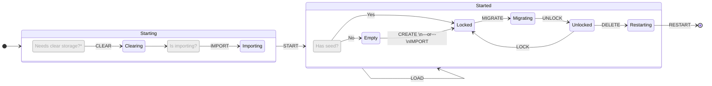

# @exodus/application

The `application` package represents the high-level application that
uses the Exodus SDK.

## Table of Contents

- [How it works](#how-it-works)
- [Usage](#usage)
- [Lifecycle Hooks](#lifecycle-hooks)
  - [Available hooks](#available-hooks)
  - [Visual representation](#visual-representation)

## How it works

It orchestrates the creation, importation, deletion, and restoration
of wallets, handles security aspects like locking and passphrase
management, and provides a flexible hook system for other components
to respond to lifecycle events.

## Usage

This feature is available as part of `@exodus/headless`, there is no
need to install it separately.

For examples on using this feature in both the API and UI side,
please refer to the related [SDK playground page](https://exodus-hydra.pages.dev/features/application).

### Lifecycle Hooks

While using the Exodus SDK, the application can subscribe to several
lifecycle hooks, which are triggered in `application` package.

Hooks subscriptions are handled by registering a `plugin` node
against the IoC container. The plugin can export several different
hooks, which are invoked when the corresponding lifecycle event happens.

For instance, if you want to run some code when the application is
started, you can create a plugin like this:

```typescript
const plugin = () => {
  const onStart = () => {
    // Run some code when the application starts
  }

  return {
    onStart,
  }
}

const myPluginDefinition = {
  id: 'myPlugin', // unique id
  type: 'plugin', // type of the node
  factory: plugin, // factory function
}
```

### Available hooks

Each of the following hooks, might or might not receive parameters.

- `onStart`: Triggered when the application starts.
- `onRestart`: Triggered when the application restarts.
- `onStop`: Triggered when the application stops.
- `onLoad`: Triggered after `onStart` when the application is loaded.
- `onUnload`: Triggered when the application is unloaded, i.e.,
  the app is closed.
- `onCreate`: Triggered when a new wallet is created.
- `onImport`: Triggered when a wallet is imported.
- `onDelete`: Triggered when a wallet is deleted.
- `onRestore`: Triggered when a wallet (primary seed) restore process starts.
- `onRestoreComplete`: Triggered when a wallet seed restore process completes.
- `onAddSeed`: Triggered when a new extra seed is added to the wallet.
- `onRestoreSeed`: Triggered when a seed restore process starts.
  and added to the wallet.
- `onAssetsSynced`: Triggered when the assets are synced.
- `onChangePassphrase`: Triggered when the passphrase is changed.
- `onLock`: Triggered when the application is locked.
- `onUnlock`: Triggered when the application is unlocked.
- `onClear`: Triggered when the application is cleared, i.e.,
  after the current wallet is deleted.

### Visual representation

Below you can find a state diagram that visualize what hooks are triggered between state transitions:



\* Wallet needs to clear storage if seed is not present or is restoring a new wallet
