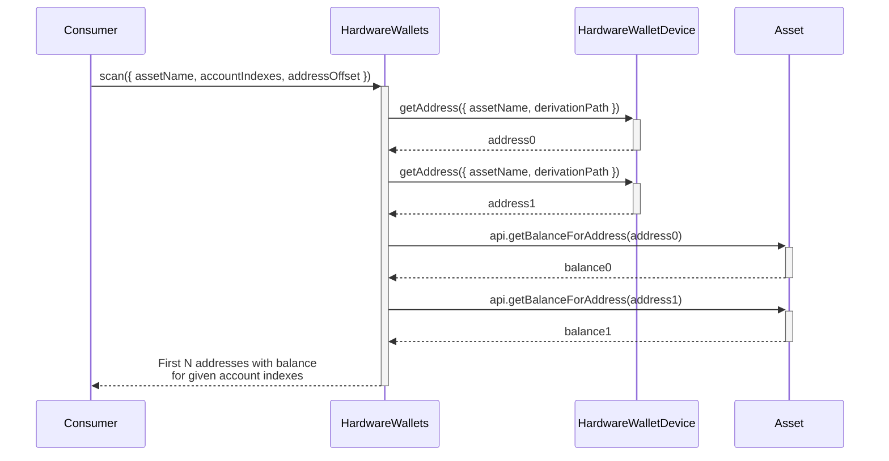
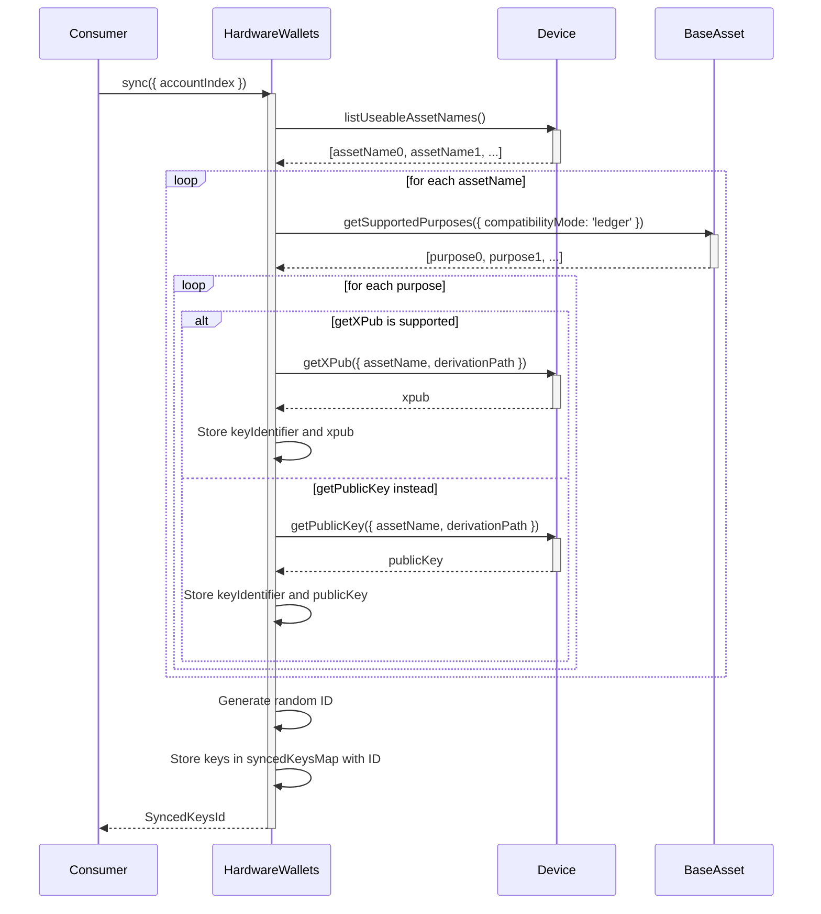
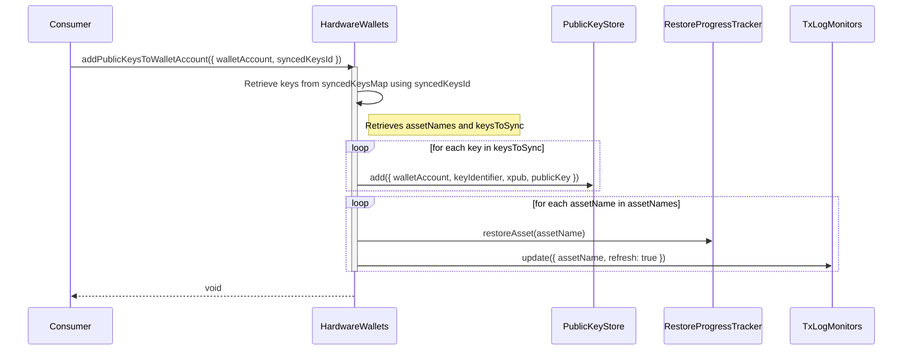

# @exodus/hardware-wallets

This feature is a high level abstraction for interacting with hardware wallet devices.

|       Feature        | Supported |
| :------------------: | :-------: |
| Syncing Public Keys  |    ✅     |
| Signing Transactions |    ✅     |
|   Signing Messages   |    ✅     |
| Firmware Management  |    ❌     |

## Device Support Matrix

| Manufacturer | Device Model | Supported |
| :----------: | :----------: | :-------: |
|    Ledger    |    Nano S    |    ✅     |
|    Ledger    |   Nano S+    |    ✅     |
|    Ledger    |    Nano X    |    ✅     |
|    Ledger    |     Stax     |    ✅     |
|    Trezor    |     One      |    ❌     |
|    Trezor    |      T       |    ❌     |
|    Trezor    |    Safe 3    |    ❌     |
|    Trezor    |    Safe 5    |    ❌     |

## Usage

### With IoC

```typescript
import hardwareWallets from '@exodus/hardware-wallets'

ioc.use(hardwareWallets())
```

## Architecture

### Terminology

A bit of terminology might be required to properly understand the distinctions between the various "states" of an asset.

- **supported** assets: All assets supported by our implementation for the device.
- **installed** assets: All assets supported by our implementation AND installed on the device by the user.
- **useable** assets: All assets supported by our implementation, installed on the device AND opened on the device (ledger).
- **synced** assets: All assets for which the public keys have been synced to the wallet account fusion channel.

### `scan({ assetName, accountIndexes, addressLimit, addressOffset })`

The `scan` functions is used during onboarding to retrieve the addresses (n=2) starting at `addressOffset` for each account index in `accountIndexes` from the hardware wallet device. It retrieves the corresponding balance using an network API call. Calling this function does not make any permanent state changes and all its state is ephemeral. This function serves to allow the user to "scan" the accounts, their addresses and balances without having to commit to an account index & syncing it completely yet.

> [!CAUTION]
> This function must only be used during onboarding of a hardware wallet device.



### `sync({ accountIndex })`

Synchronizes public keys (XPUBs / public keys) for all useable assets for a given `accountIndex` from a hardware wallet device and stores them temporarily for future use. The hardware wallet device may disconnect after this method has been called and onboarding would still be possible.

> [!CAUTION]
> Only a subset of the supported assets may be synced. Some hardware wallet devices like Ledger do not support multiple assets at the same time because the asset-specific application must be installed and opened on the device.



### `addPublicKeysToWalletAccount({ walletAccount, syncedKeysId })`

Adds public keys (XPUBS / public keys) to an existing wallet account.

- Moves the synchronized public keys (XPUBs / public keys) for `syncedKeysId` identifier from the temporary in-memory objectmap to a `walletAccounts`'s public key store which will store it in fusion.
- Start a restore procedure for the assets & trigger a refresh of the `txLogMonitor`



### `create({ syncedKeysId })`

Creates a new hardware wallet account and calls `addPublicKeysToWalletAccount()` to synchronize public keys to the newly created wallet account.
