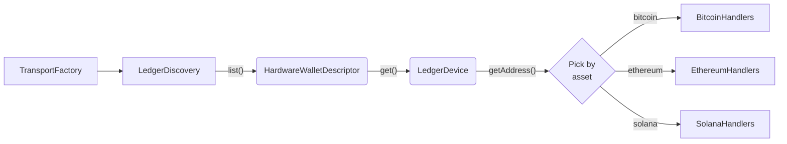

# @exodus/hw-ledger



## Usage

```typescript
import createLedgerDiscover from '@exodus/hw-ledger'
import Transport from '@ledgerhq/hw-transport-node-speculos'

// Initialize transport factories depending on the platform
const ledgerDiscovery = createLedgerDiscover({
  logger,
  transports: {
    tcp: Transport, // emulator transport over tcp
  },
})

const ledgerDescriptors = await ledgerDiscovery.list()
// [
//   {
//       manufacturer: 'ledger',
//       transportType: 'tcp',
//       get: function () => { ... }
//   }
// ]

let ledgerDevice = null
try {
  ledgerDevice = await ledgerDescriptors[0].get()
} catch (err) {
  // Instantiating the device may fail, deal with this.
  // e.g unplugged, udev issues, no networking
  logger.error(`Unable to connect to device.`, err)
}

if (ledgerDevice) {
  const address = await ledgerDevice.getAddress({
    assetName: 'bitcoin',
    derivationPath: `m/86'/0'/0'/0/0`,
  })
  logger.log(`bitcoin address is ${address}`)
  // bc1p5cyxnuxmeuwuvkwfem96lqzszd02n6xdcjrs20cac6yqjjwudpxqkedrcr
}
```

## Development

If you're on Linux then it's highly likely that you'll want to setup your udev rules.

### Installing Ledger Emulator (Recommended)

Clone the speculos repository & change your current working directory

```bash
git clone https://github.com/LedgerHQ/speculos.git --branch v0.3.5 --single-branch --depth 1 speculos-0.3.5
cd speculos-0.3.5
```

Get the Docker image

```bash
docker image pull ghcr.io/ledgerhq/speculos:sha-8241dc2 # v0.3.5
docker image tag ghcr.io/ledgerhq/speculos:sha-8241dc2 speculos
```

Get the Docker image for ARM (M1/M2)

```bash
docker image build -t ghcr.io/ledgerhq/speculos-builder:latest -f build.Dockerfile .
docker image build -t speculos:latest .
```

Launch the emulator while within the `speculos` directory

```bash
docker container run --rm -it -v "$(pwd)"/apps:/speculos/apps:ro \
-p 127.0.0.1:4000:4000 -p 127.0.0.1:40000:40000 speculos \
--display headless --api-port 4000 --apdu-port 40000 --seed "secret" --model nanos --sdk 2.0 ./apps/btc.elf
```

Now visit http://127.0.0.1:4000 to interact with the emulator.

### MacOS launch issues:

- `port XXXX is already in use`: re-map any available host port ([doc](https://docs.docker.com/network/#published-ports))

### Install udev rules for real devices (Linux only)

If you want to talk with real devices then you might require setting up udev rules.

```bash
sudo ./scripts/setup_udev.sh
```
