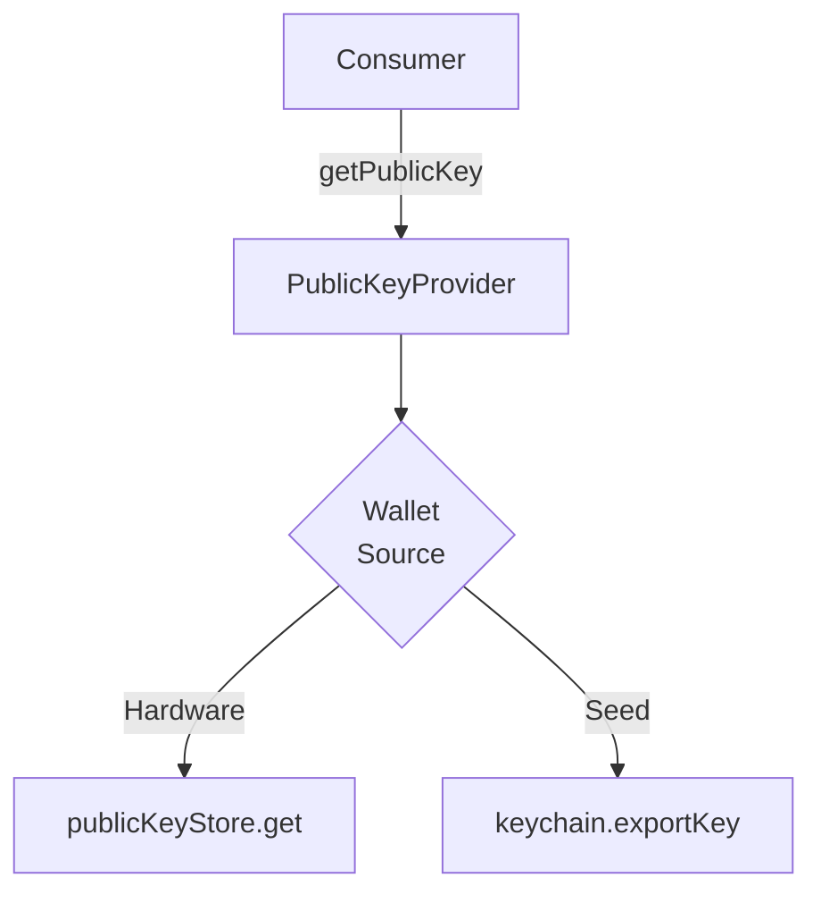

# @exodus/public-key-provider

Handles unified access to public keys from software and different hardware wallets.



## Install

```sh
yarn add @exodus/public-key-provider
```

## Usage

This feature is designed to be used together with `@exodus/headless`. See [using the sdk](../../docs/development/using-the-sdk.md).

### Play with it

1. Open the playground https://exodus-hydra.pages.dev/features/public-key-provider
2. Try out the some methods via the UI. These corresponds 1:1 with the `exodus.publicKeyProvider` API.
3. Run the below in the Dev Tools Console:

```js
await exodus.publicKeyProvider.getPublicKey({
  walletAccount: 'exodus_0',
  keyIdentifier: {
    derivationAlgorithm: 'BIP32',
    derivationPath: "m/44'/0'/0'/0/0",
    keyType: 'secp256k1',
  },
})
```

### API Side

See [using the sdk](../../docs/development/using-the-sdk.md#setup-the-api-side) for more details on how features plug into the SDK and the API interface in the [type declaration](./api/index.ts).

```ts
const publicKey = await exodus.publicKeyProvider.getPublicKey({
  walletAccount: 'exodus_0',
  keyIdentifier,
})

const xpub = await exodus.publicKeyProvider.getExtendedPublicKey({
  walletAccount: 'exodus_0',
  keyIdentifier,
})
```
