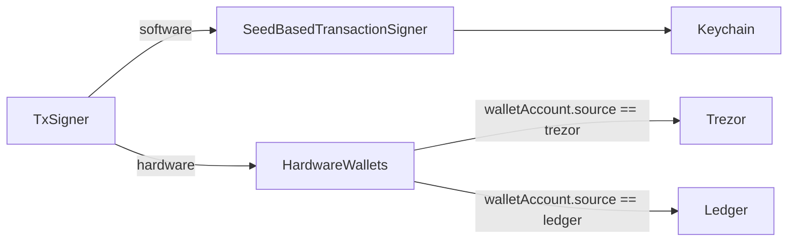

# @exodus/tx-signer

The transaction signer delegates signing of transactions to the corresponding software or hardware wallet.



## Install

```sh
yarn add @exodus/tx-signer
```

## Usage

This feature is designed to be used together with `@exodus/headless`. See [using the sdk](../../docs/docs-website/docs/development/using-the-sdk.md).

### Play with it

1. Open the playground https://exodus-hydra.pages.dev/features/tx-signer
2. Try out the some methods via the UI. These corresponds 1:1 with the `exodus.transactionSigner` API.

### API Side

See [using the sdk](../../docs/docs-website/docs/development/using-the-sdk.md#setup-the-api-side) for more details on how features plug into the SDK and the API interface in the [type declaration](./src/api/index.ts).

```ts
const result = await exodus.transactionSigner.signTransaction({
  baseAssetName: 'bitcoin',
  walletAccount: WalletAccount.DEFAULT,
  unsignedTx: {
    txData: {
      // your tx data
    },
    txMeta: {
      // your tx meta
    },
  },
})
```
