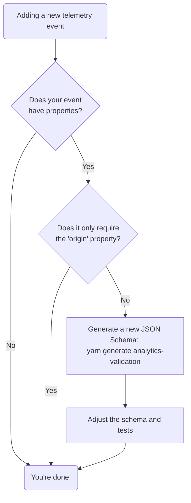

# @exodus/analytics-validation

## Why

This helps prevent that we do not accidentally collect any sensitive and/or private information, therefore all events must pass a validation layer.

Examples of what could go wrong:

- [Slope Finance sending 12-word mnemonics to Sentry 💀](https://twitter.com/osec_io/status/1555087560887922688?s=20)

## Development

### Do I need to add a new schema?



### JSON Schema Development

To add a new schema run

```bash
yarn generate analytics-validation
```

in the project root. The CLI tool will ask you for all details needed.
Once the schema is created, make sure to

1. Before adding a new schema, double check if a subdirectory (essentially an event domain, e.g. `dapps`) already exists in `./src`. If not, you will have to come up with a subdirectory name during the next steps;
2. Fill the schema with the expected properties and their types. The property names must be in the **snake_case** (e.g. `expected_property`);
3. Fix the generated unit test as it will be intentionally failing;
4. Add your own test cases to ensure the schema works properly before merging the PR and publishing a new version.

#### List of string formats

Schemasafe ships with a bunch of default formats, [you can find the implementation of these here!](https://github.com/ExodusMovement/schemasafe/blob/master/src/formats.js)

- email
- hostname
- uuid
- date
- time
- date-time
- duration
- ipv4
- ipv6
- uri
- uri-reference
- uri-template
- alpha
- alphanumeric
- base64
- hex-digits
- hex-digits-prefixed
- hex-bytes
- hex-bytes-prefixed
- json-pointer
- relative-json-pointer
