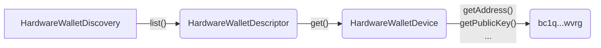

# @exodus/hw-common

This package shares the commons Ledger & someday Trezor.

## Architecture

- `HardwareWalletDiscovery`: interface for device discovery
  - `list()` will return a list of discoved devices
- `HardwareWalletDescriptor`: interface to uniquely identify a device and offers factory for `HardwareWalletDevice`
  - `get()` will return an instance of a device
- `HardwareWalletDevice`: interface for common actions such as getting addresses, public keys and signing.
  - `getAddress(...)` for example, would get an address based on the `assetName`
